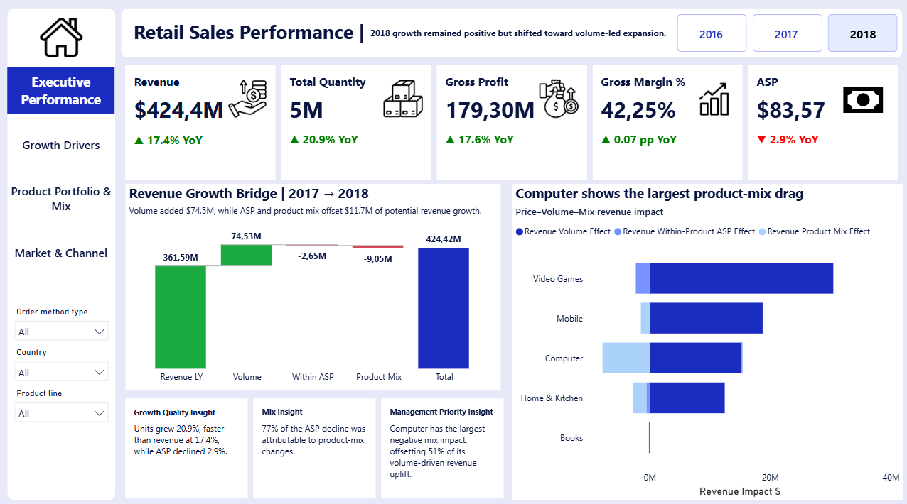
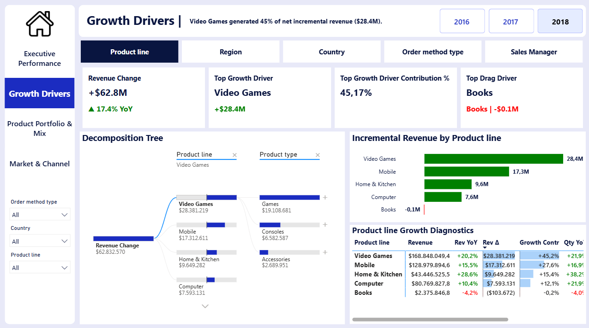
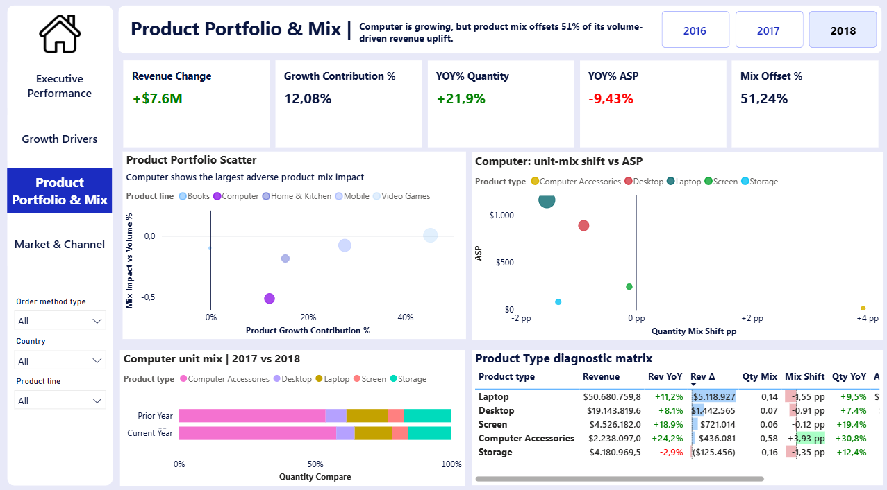
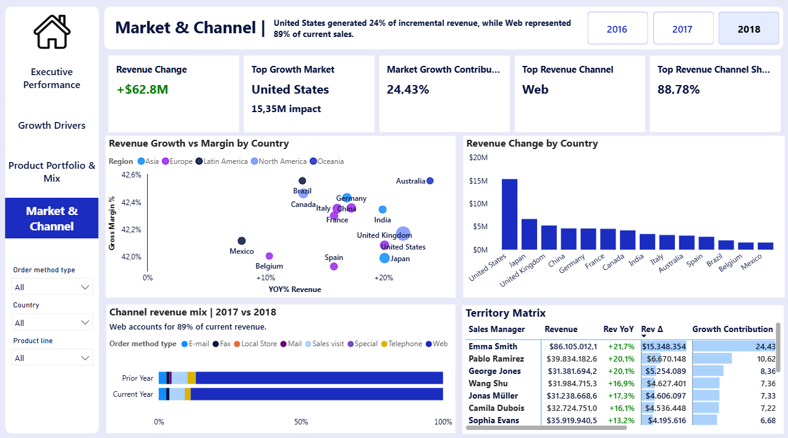

# Retail Revenue Growth & Profitability Diagnostic

A management-oriented Power BI case study explaining **how retail revenue grew, what drove the change, where growth was concentrated, and which signals management should investigate next**.

> **Dataset:** Starttrain – The Next Analyst Challenge Season 1  
> **Period:** 2016–2018  
> **Records:** 72,743  
> **Coverage:** 14 countries · 5 product lines · 19 product types · 6 order methods  
> **Tools:** Power BI · Power Query · DAX  
> **Technical reference:** [Reviewed DAX measure library](docs/dax-measure-library.md)

---

## Executive Snapshot

2018 revenue reached approximately **$424.4M**, up **17.4% YoY**. Growth was strong, but its quality was more nuanced:

| Signal | 2018 Result | Interpretation |
| --- | ---: | --- |
| Revenue | **$424.4M** | **+17.4% YoY** |
| Unit Volume | — | **+20.9% YoY** |
| ASP | — | **-2.9% YoY** |
| Gross Profit | — | **+17.6% YoY** |
| Gross Margin | **42.25%** | broadly resilient |
| Net Revenue Change | **+$62.8M** | fully reconciled through PVM |
| Volume Effect | **+$74.5M** | main growth engine |
| ASP + Mix Effects | **-$11.7M** | partially offset volume-led growth |

**Bottom line:** growth became increasingly **volume-led rather than value-led**. Aggregate ASP declined, but roughly **77% of that decline was explained by product-mix shifts rather than broad-based within-product ASP deterioration**.

Three management signals stood out:

1. **Product concentration:** Video Games and Mobile generated approximately **73% of net incremental revenue**.
2. **Mix dilution:** Computer volume growth was strong, but product mix offset roughly **51% of its volume-driven revenue uplift**.
3. **Channel concentration:** Web represented about **88.8% of current revenue** and generated approximately **99.5% of net incremental growth**.

---

## Business Questions

The analysis was designed to move beyond descriptive reporting and answer four questions:

1. **How healthy is revenue growth?**
2. **What is actually driving incremental revenue?**
3. **Which products are growing with strong or weak growth quality?**
4. **Which markets and channels are driving or concentrating business performance?**

The dashboard therefore follows a simple decision flow:

**What changed → Why it changed → Where the impact came from → What management should investigate next**

---

## Key Findings

### 1. Growth shifted toward volume

Revenue grew **17.4%**, while unit volume grew faster at **20.9%** and ASP declined **2.9%**.

At the same time, Gross Profit increased **17.6%** and Gross Margin remained approximately **42.25%**.

This suggests that the company expanded primarily by selling more units rather than by increasing revenue per unit.

---

### 2. Volume created more growth than the company ultimately retained

The Price–Volume–Mix bridge reconciled the full **+$62.8M** YoY revenue change:

| Revenue Driver | Impact |
| --- | ---: |
| Volume Effect | **+$74.5M** |
| Within-Product ASP Effect | **-$2.6M** |
| Product Mix Effect | **-$9.0M** |
| **Net Revenue Change** | **+$62.8M** |

Volume expansion generated substantial upside, but approximately **$11.7M** was offset by within-product ASP and product-mix effects.

---

### 3. Most of the ASP decline was mix-driven

Company ASP decreased by approximately **$2.52 per unit**:

- Within-product ASP effect: **-$0.57**
- Product-mix effect: **-$1.95**

Approximately **77% of the ASP decline** was therefore attributable to mix changes.

This matters because a lower aggregate ASP does **not** automatically mean broad-based price deterioration.

---

### 4. Computer showed the clearest growth-quality trade-off

Computer revenue still grew approximately **10.4%**, supported by unit growth of **21.9%**.

However:

- Volume Effect: **+$15.25M**
- Product Mix Effect: **-$7.81M**

The mix effect offset roughly **51%** of the uplift generated by volume.

Drill-down showed that lower-value **Computer Accessories** gained unit share while higher-value **Laptop** and **Desktop** products lost share.

---

### 5. Incremental revenue was concentrated in a small number of product lines

Video Games contributed approximately **$28.4M**, equal to **45.2%** of net company revenue growth.

Mobile contributed another **27.6%**.

Together, the two product lines generated approximately **73% of 2018 incremental revenue**, creating meaningful concentration in the company’s growth engine.

---

### 6. Geographic growth was more diversified

The United States was the largest geographic contributor:

- Incremental Revenue: **+$15.35M**
- Growth Contribution: **24.4%**

However, the top three markets represented only about **43% of incremental revenue**, indicating substantially more geographic diversification than product- or channel-level growth.

---

### 7. Growth was highly dependent on Web

Web represented approximately:

- **88.8% of current revenue**
- **99.5% of net incremental revenue**

Its revenue share also increased by approximately **1.86 percentage points** versus the prior year.

This creates a clear concentration signal: the company’s growth became increasingly dependent on one order method.

---

## Management Implications

| Priority | Evidence | Management implication |
| --- | --- | --- |
| **Protect core growth engines** | Video Games + Mobile generated ~73% of incremental revenue | Monitor availability, margin quality, and sustainability of the product lines carrying most growth |
| **Review Computer mix** | -$7.81M mix effect offset ~51% of volume uplift | Investigate why lower-value product types gained share and whether the mix shift is intentional |
| **Monitor Home & Kitchen mix** | Strong growth accompanied by meaningful mix-driven ASP dilution | Track whether unit growth is being achieved at the expense of value mix |
| **Monitor channel concentration** | Web generated ~99.5% of incremental revenue | Assess dependency on Web and compare other channels using economics and strategic role, not revenue alone |

These are **diagnostic implications**, not causal conclusions. The available data identifies patterns that deserve management attention but does not establish why those patterns occurred.

---

## Dashboard

### Page 1 — Executive Performance
**Question:** How did the company grow?

Includes:

- Revenue, Gross Profit, Gross Margin, Volume, and ASP
- Price–Volume–Mix revenue bridge
- Product-line PVM comparison
- Growth-quality and management-priority signals

---

### Page 2 — Growth Drivers
**Question:** Where did incremental revenue come from?

Includes:

- Dynamic growth-driver selection
- Revenue Change by Product / Region / Country / Channel
- Growth Contribution analysis
- Decomposition tree
- Growth diagnostic matrix

The page focuses on **incremental growth**, not simply ranking segments by current business size.

---

### Page 3 — Product Portfolio & Mix
**Question:** Which products are generating high-quality growth, and why?

Includes:

- Product Growth Contribution vs Mix Impact
- Product-type quantity-mix comparison
- Quantity Mix Shift vs ASP
- Product diagnostic matrix
- Mix Offset analysis

---

### Page 4 — Market & Channel Performance
**Question:** Which markets and channels are driving business performance?

Includes:

- Revenue Growth vs Gross Margin by country
- Incremental Revenue by market
- Prior-year vs current-year channel mix
- Territory performance matrix

> Manager results represent assigned territory performance and are not normalized for market potential, sales targets, or territory difficulty.

---

## Analytical Methodology

### 1. Price–Volume–Mix decomposition

Revenue change was decomposed into:

**Revenue Change = Volume Effect + Within-Product ASP Effect + Product Mix Effect**

The bridge values quantity change at prior-year ASP in the current filter context, uses midpoint quantity weighting for within-product ASP movement, and assigns the remaining reconciled effect to product mix / assortment. Product-level rows are treated as local diagnostics rather than additive allocations of the company-level components.

The bridge was validated with:

**Revenue PVM Residual = $0**

This ensures that the analytical decomposition fully reconciles to actual revenue growth.

### 2. Product-mix diagnostic

Aggregate ASP movement was decomposed into:

**ASP Change = Within-Product ASP Effect + Product Mix Effect**

This distinguishes between:

- selling value changes within existing product types, and
- ASP movement caused by changes in the mix of higher- and lower-value product types.

### 3. Growth contribution

Instead of ranking segments only by total revenue, the analysis measures **contribution to incremental revenue**.

This identifies which products, markets, and channels actually created or diluted year-over-year growth.

---

## Data Model & KPI Layer

The report uses a star-schema-style model with `Sales` as the central fact table and supporting dimensions for:

- Calendar
- Product
- Region
- Sales Manager / Territory

Relationships use **one-to-many cardinality** with **single-direction filtering from dimension to fact**.

Disconnected tables and field parameters support:

- Revenue growth bridge
- Prior-year vs current-year comparison
- Dynamic growth-driver selection

### Core KPIs

**Performance**
- Revenue
- Revenue YoY %
- Revenue Change
- Gross Profit
- Gross Profit YoY %
- Gross Margin %
- Gross Margin Change
- Quantity Growth
- Average Selling Price
- ASP Growth

**Diagnostic**
- Revenue Volume Effect
- Within-Product ASP Effect
- Product Mix Effect
- Growth Contribution %
- Mix Offset %
- Quantity Mix Shift
- Channel Revenue Share
- Channel Mix Shift
- Market Growth Contribution

---

## Validation & Analytical Discipline

The analysis includes several controls to reduce misleading interpretation:

- The PVM bridge reconciles fully to actual revenue growth: **Residual = $0**
- Aggregate ASP decline is separated into within-product and mix effects rather than being treated as pure pricing deterioration
- Manager performance is not normalized for market potential, sales targets, or territory difficulty
- Findings are treated as **diagnostic signals rather than causal evidence**

---

## Limitations

The dataset does not include:

- Sales quotas or targets
- Commission or incentive data
- Customer acquisition or marketing cost
- Territory-potential normalization

Additional limitations:

- ASP movements may still contain geographic, channel, or lower-level product-mix effects
- Gross Profit does not represent full operating profitability
- Historical transactional patterns do not establish causality

---

## Skills Demonstrated

**Business Analytics**
- Revenue variance analysis
- Profitability analysis
- Price–Volume–Mix decomposition
- Product-mix diagnostics
- Growth-contribution analysis
- Management-oriented data storytelling

**BI & Data**
- Power BI
- DAX
- Power Query
- Dimensional data modeling
- Dynamic field parameters
- Interactive dashboard design
- Analytical validation and reconciliation
